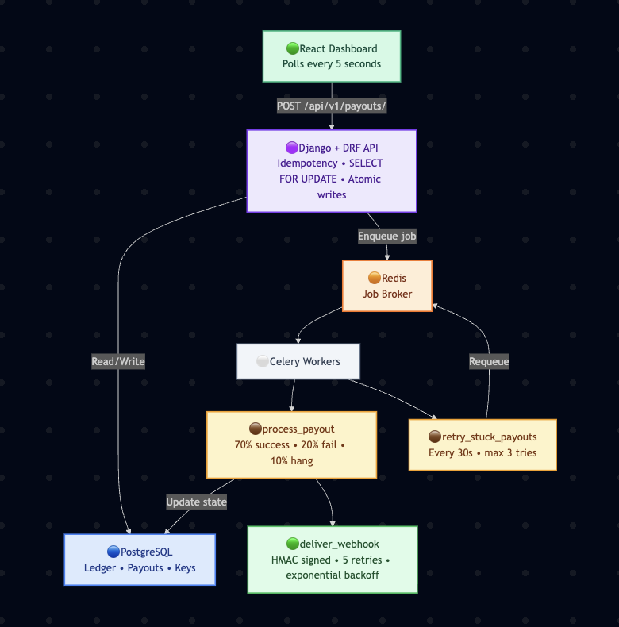
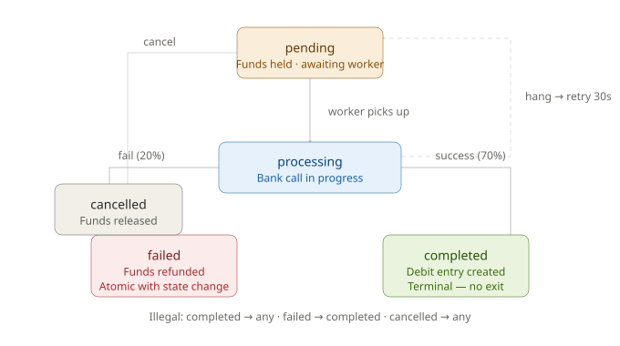

# Playto Payout Engine

> **Built for the Playto Founding Engineer Challenge.**  
> A production-grade payout engine that handles the real hard problems — not just the happy path.

**Live demo:** `https://payout-engine-ten.vercel.app/` &nbsp;·&nbsp; **Stack:** Django · PostgreSQL · Celery · Redis · React

---

## Architecture



The system has one direction of complexity: **inward**. A request comes in from React, hits Django, acquires a database lock, creates a payout atomically, and returns immediately. The actual bank processing happens in a background worker — the merchant never waits for it.

---

## Payout request lifecycle

Every payout request goes through these steps in order. If any step fails, everything before it rolls back.

```
POST /api/v1/payouts/
  │
  ├─ Idempotency key seen before? → return cached response (no db write)
  │
  ├─ SELECT FOR UPDATE → lock merchant ledger rows in PostgreSQL
  │
  ├─ Balance check: credits − debits − held ≥ amount?
  │   └─ No → 422 Insufficient balance (same response cached for this key)
  │
  ├─ ATOMIC: create Payout + save IdempotencyKey (same transaction)
  │
  ├─ Return 201 to client immediately
  │
  └─ process_payout.delay(id) → Celery picks up from Redis queue
       ├─ 70% → completed + debit ledger entry
       ├─ 20% → failed + credit refund (atomic with state change)
       └─ 10% → hang → retry_stuck_payouts picks up after 30s
```

---

## State machine



Legal transitions are encoded in a dict. Every state change goes through `transition_to()` — which raises `ValueError` before touching the database if the transition is illegal.

```python
LEGAL_TRANSITIONS = {
    'pending':    ['processing', 'cancelled'],
    'processing': ['completed', 'failed'],
    'completed':  [],   # terminal
    'failed':     [],   # terminal
    'cancelled':  [],   # terminal
}
```

`failed → completed` is not a bug we catch at runtime. It structurally cannot happen.

---

## The five problems I actually solved

### 1. Money never stored as a decimal

```python
# ❌ What most people write (breaks in production)
amount = 99.99      # FloatField
balance = 150.50 - 99.99
# → 50.51000000000001  ← real bug, happens constantly

# ✅ What this codebase does
amount = 9999       # BigIntegerField — paise, always integer
balance = 15050 - 9999
# → 5051  ← exact, always
```

₹1 = 100 paise. Everything is stored as integers. Displayed as rupees only in the UI.

---

### 2. Two simultaneous withdrawals can't both succeed

```python
# ❌ What AI first suggested — looks fine, has the race condition
balance = merchant.get_balance_summary()      # Python fetch
if balance['available_paise'] >= amount:      # check here
    Payout.objects.create(...)                # act here — gap = bug

# ✅ What this codebase does
with transaction.atomic():
    locked = LedgerEntry.objects.select_for_update().filter(merchant=merchant)
    agg = locked.aggregate(
        credits=Sum('amount_paise', filter=Q(entry_type='credit')),
        debits=Sum('amount_paise',  filter=Q(entry_type='debit')),
    )
    held = Payout.objects.select_for_update().filter(
        merchant=merchant, status__in=['pending','processing']
    ).aggregate(held=Sum('amount_paise'))['held'] or 0

    available = (agg['credits'] or 0) - (agg['debits'] or 0) - held

    if available < amount:
        return Response({'error': 'Insufficient balance'}, status=422)

    Payout.objects.create(...)   # inside the same lock — no gap
```

`SELECT FOR UPDATE` is a PostgreSQL primitive. It locks the rows at the database level — the one place all Gunicorn workers share state. A Python `threading.Lock()` doesn't protect against multiple server processes.

---

### 3. The same request sent twice creates one payout, not two

```python
# Every payout request requires this header:
# Idempotency-Key: 550e8400-e29b-41d4-a716-446655440000

# First call — processes normally, stores the exact response
IdempotencyKey.objects.create(
    key=idempotency_key, merchant=merchant,
    response_body=response,     # stored verbatim
    response_status=201,
    expires_at=now() + 24 hours,
)

# Second call with same key — returns stored response, touches nothing
existing = IdempotencyKey.objects.get(key=key, merchant=merchant)
return Response(existing.response_body, status=existing.response_status)
```

If two requests arrive simultaneously (before either commits), the `unique_together` constraint on `(key, merchant)` fires an `IntegrityError` on the second one — which we catch and handle gracefully.

---

### 4. Failed payouts refund atomically

```python
# Both happen in one transaction. If either fails, both roll back.
def _fail_payout_and_release_funds(payout, reason):
    with transaction.atomic():
        payout.transition_to('failed', failure_reason=reason)
        payout.save()
        LedgerEntry.objects.create(
            merchant=payout.merchant,
            amount_paise=payout.amount_paise,
            entry_type='credit',              # money returns to merchant
            description=f'Payout refund: {reason}',
        )
```

There is no state where a payout is marked `failed` but the merchant's money hasn't been returned. The transaction makes them one single event.

---

### 5. Stuck payouts are retried automatically

```python
# Celery Beat runs this every 30 seconds
@shared_task
def retry_stuck_payouts():
    stuck_cutoff = now() - timedelta(seconds=30)
    stuck = Payout.objects.filter(
        status='processing',
        processing_started_at__lt=stuck_cutoff,
    ).select_for_update(skip_locked=True)    # skip rows other workers are handling

    for payout in stuck:
        if payout.attempt_count >= 3:
            fail_and_refund(payout, 'Timed out after 3 attempts')
        else:
            payout.status = 'pending'        # reset — try again
            payout.save()
            process_payout.delay(payout.id)
```

---

## The ledger model

Balance is never stored. It is always computed from immutable ledger entries.

```sql
-- This must always equal what the dashboard shows.
-- We verify this in tests. It never drifts.
SELECT
  SUM(amount_paise) FILTER (WHERE entry_type = 'credit') -
  SUM(amount_paise) FILTER (WHERE entry_type = 'debit')
FROM payout_engine_ledgerentry
WHERE merchant_id = X;
```

Why not store balance on the merchant row? If a bug corrupts it, there's no way to reconstruct the truth. The ledger *is* the truth.

---

## Full API

| Method | Endpoint | What it does |
|--------|----------|--------------|
| `GET` | `/api/v1/merchants/` | List all merchants |
| `GET` | `/api/v1/merchants/{id}/` | Balance + bank accounts |
| `GET` | `/api/v1/merchants/{id}/ledger/` | Transaction history |
| `GET` | `/api/v1/merchants/{id}/ledger/export/` | Download as CSV |
| `GET` | `/api/v1/merchants/{id}/payouts/?status=` | Payout history with filter |
| `GET` | `/api/v1/merchants/{id}/analytics/` | Success rate, volume, daily chart data |
| `POST` | `/api/v1/merchants/{id}/bank-accounts/` | Add a bank account |
| `POST` | `/api/v1/merchants/{id}/bank-accounts/{id}/set-primary/` | Change primary |
| `GET/POST` | `/api/v1/merchants/{id}/webhooks/` | List or add webhook endpoints |
| `DELETE` | `/api/v1/merchants/{id}/webhooks/{id}/` | Remove webhook endpoint |
| `GET` | `/api/v1/merchants/{id}/webhook-deliveries/` | Delivery log for debugging |
| `POST` | `/api/v1/payouts/` | **Create payout** — requires `Idempotency-Key` header |
| `GET` | `/api/v1/payouts/{id}/` | Payout status |
| `POST` | `/api/v1/payouts/{id}/cancel/` | Cancel a pending payout |
| `GET` | `/api/v1/summary/` | Platform-wide stats |

---

## Webhook delivery

On every payout state change, this engine POSTs to all registered webhook URLs:

```json
{
  "event": "payout.completed",
  "payout_id": "550e8400-e29b-41d4-a716-446655440000",
  "amount_paise": 50000,
  "status": "completed",
  "merchant_id": "...",
  "timestamp": "2026-04-28T14:23:01Z"
}
```

Signed with HMAC-SHA256. Delivery failures retry: 30s → 60s → 120s → 240s → 480s, up to 5 attempts.

---

## How to run it

### Docker — one command

```bash
git clone <repo-url>
cd playto-payout
docker-compose up --build
```

- **Frontend:** http://localhost:3000  
- **API:** http://localhost:8000/api/v1/  
- **Admin:** http://localhost:8000/admin/

Migrations and seed data run automatically.

### Manual

```bash
cd backend
python -m venv venv && source venv/bin/activate
pip install -r requirements.txt

export DB_NAME=playto_db DB_USER=postgres DB_PASSWORD=postgres
export DB_HOST=localhost DB_PORT=5432 REDIS_URL=redis://localhost:6379/0

createdb playto_db
python manage.py migrate
python manage.py seed_data
python manage.py runserver

# Celery worker (new terminal)
celery -A playto worker --loglevel=info

# Celery beat — retries stuck payouts every 30s (new terminal)
celery -A playto beat --loglevel=info

# Frontend (new terminal)
cd frontend && npm install && npm run dev
```

---

## Tests

```bash
cd backend
python manage.py test payout_engine
```

**Concurrency test** — two real OS threads, same ₹100 balance, both request ₹60 simultaneously. Exactly one succeeds. Uses `TransactionTestCase` (not `TestCase`) because `TestCase` wraps everything in one transaction which makes `SELECT FOR UPDATE` meaningless.

**Idempotency test** — same request, same key, sent twice. Same payout ID returned, one row in the database.

**State machine test** — every illegal transition attempted. `ValueError` raised before any database write.

**Ledger invariant test** — known credits and debits, asserts computed balance matches exactly.

---

## Project structure

```
playto-payout/
├── assets/
│   ├── architecture.svg       System architecture diagram
│   └── state_machine.svg      Payout state machine diagram
├── backend/
│   ├── playto/
│   │   ├── settings.py        Django config, Celery beat schedule
│   │   ├── celery.py          Celery app setup
│   │   └── urls.py            Root URL routing
│   └── payout_engine/
│       ├── models.py          All database tables + state machine
│       ├── views.py           All API endpoints + concurrency logic
│       ├── tasks.py           Celery: process, retry, webhook delivery
│       ├── urls.py            App URL routing (16 endpoints)
│       ├── tests.py           Concurrency + idempotency + invariant tests
│       ├── admin.py           Django admin for all models
│       └── management/commands/seed_data.py
├── frontend/
│   └── src/
│       ├── App.jsx            Dashboard: 6 tabs, analytics, cancel, export, webhooks
│       └── index.css          Design system
├── docker-compose.yml         6 services: db, redis, backend, worker, beat, frontend
├── EXPLAINER.md               Detailed answers to all 5 challenge questions
└── README.md
```

---

## The AI audit

The first draft an AI gave me for the balance check:

```python
# ❌ AI's first suggestion
balance = merchant.get_balance_summary()
if balance['available_paise'] >= amount_paise:
    payout = Payout.objects.create(...)
```

Three bugs: no transaction, no row lock, Python arithmetic on fetched rows. This overdrafts accounts at real scale. The fix — `select_for_update()` inside `transaction.atomic()` with DB-level aggregation — required understanding PostgreSQL's concurrency model, not just adding a decorator.

---

## What I'm most proud of

```python
def _fail_payout_and_release_funds(payout, reason):
    with transaction.atomic():
        payout.transition_to('failed', failure_reason=reason)
        payout.save()
        LedgerEntry.objects.create(
            merchant=payout.merchant,
            amount_paise=payout.amount_paise,
            entry_type='credit',
            description=f'Payout refund: {reason}',
        )
```

8 lines. No state exists where the payout is marked failed but the money hasn't been returned. A crash between those two lines? PostgreSQL rolls both back. The retry task picks it up in 30 seconds. This is what production payment code looks like.
